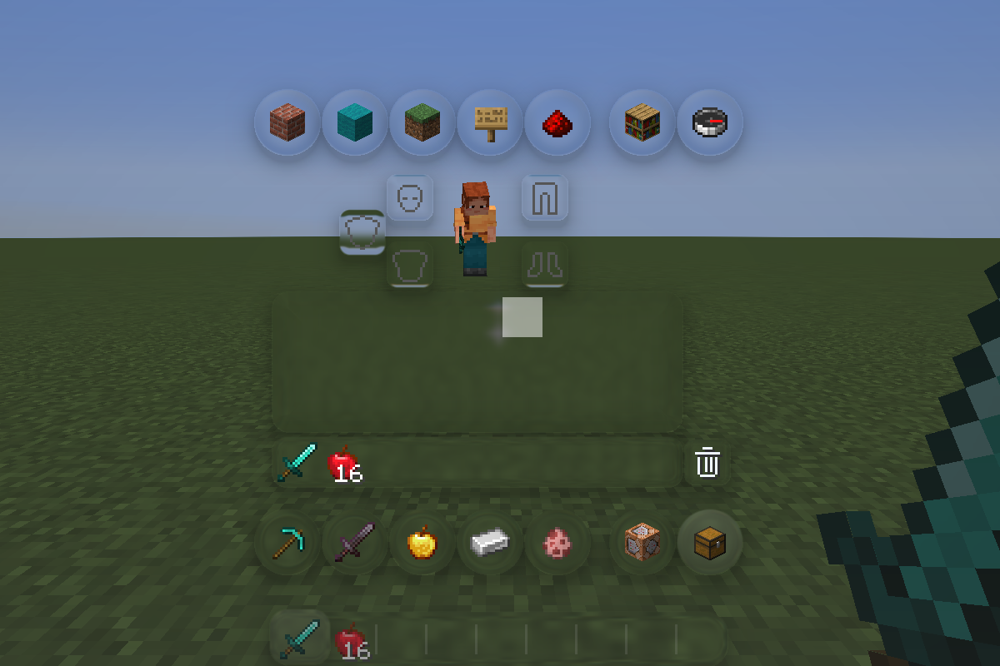
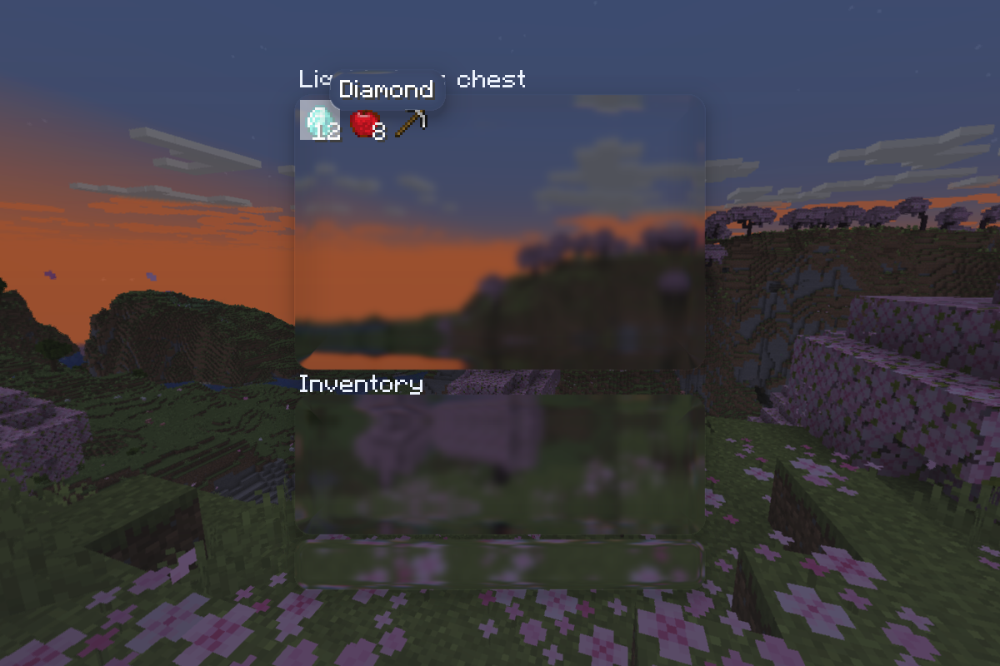
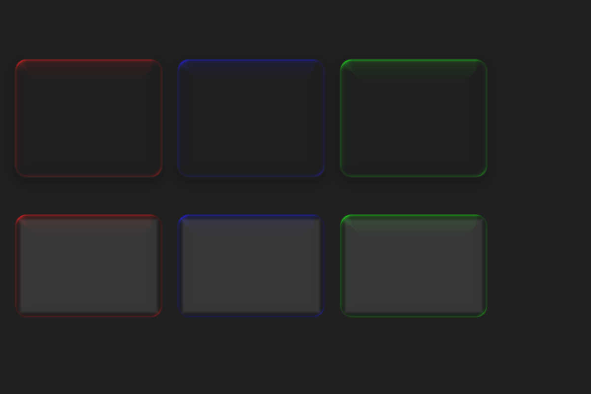

# LumaGlass

为 **Minecraft 1.20.1 / Forge** 提供液态玻璃 UI 和客户端绘制 API。

实时模糊与折射让菜单、容器和控件透出背景；圆角边缘、可调泛光与独立面板材质可以用于原版界面，也可以由其他模组接入。

**版本：0.2.8 · 作者：Sunny5349 · 许可证：MIT**

## 功能

- 默认启用原版 UI 玻璃主题，覆盖标准按钮、滑块、输入框、列表、工具提示以及多数容器与 HUD 底板。
- 保留原版物品、文字、图标、槽位、点击和滚动逻辑。
- 实时调整模糊、折射、磨砂和中性表面底色。
- 泛光调色盘支持色相、饱和度、明度、预设色块、HEX 输入、强度和关闭开关。
- 公共 API 支持独立画布、同一背景快照上的多块玻璃、贴图面板及每块面板独立泛光颜色。
- 支持窗口缩放与资源重载，提供中英文界面。

生存和创造背包使用紧凑分区：物品区共用一块玻璃，快捷栏独立成条，装备位使用小面板，人物周围留空，移除逐格凹陷底板。创造分类使用圆形按钮，聊天历史共用一块底板。模糊采用逐级低通缩小和密集高斯采样，泛光默认关闭。旧配置保留已有数值，可在工作室点击“重置”应用新版默认材质。

箱子类界面使用同样的连续玻璃分区，并默认自动适配其他模组复用的原版 UI。0.2.8 补回创造背包的摧毁物品图标；材质默认值改为模糊 15%、折射 24、磨砂 100%、表面色调 0%，泛光关闭。升级后点击工作室“重置”可应用这些默认值并启用其他模组的自动主题。





## 安装

需要 Minecraft **1.20.1**、Forge **47.4.22** 和 Java **17**。本模组仅在客户端安装。

1. 将 `lumaglass-0.2.8.jar` 放入该游戏实例的 `mods` 目录。
2. 升级时移除旧版本，只保留一个 LumaGlass JAR。不要安装 `-sources.jar` 或测试辅助模组。
3. 启动游戏，原版 UI 主题默认生效。

主菜单点击 **LumaGlass**，或在世界内按 **G** 打开工作室。底部的 **泛光调色盘** 可更改泛光颜色；点击完成或按 Esc 保存。关闭泛光后，模糊、折射和玻璃底色仍然生效。

配置文件：`config/lumaglass-client.toml`。升级时会自动补齐新配置，不需要删除已有文件。

| 配置 | 默认值 | 作用 |
| --- | --- | --- |
| `vanillaUi` | `true` | 原版界面与 HUD 主题开关 |
| `otherModUi` | `true` | 自动处理其他模组复用的原版控件与受支持的容器背景，无需主动适配 |
| `blur` | `4.8` | 平滑模糊半径，0–32；工作室显示为百分比，默认 15% |
| `refraction` | `24.0` | 边缘折射强度，0–24 |
| `frost` | `1.0` | 磨砂混合比例，0–1；1 完全使用模糊背景 |
| `tint` | `0.0` | 中性底色混合强度，0–0.4 |
| `glowEnabled` | `false` | 泛光总开关，默认关闭 |
| `glowColor` | `16777215` | 24 位 RGB 整数，默认白色 |
| `glowStrength` | `1.0` | 泛光强度，0–2 |

例如，`#40BFFF` 对应配置整数 `4243455`。可以直接用调色盘输入 HEX，无须手动换算。

## API 接入教程

公开包为 `dev.lumaglass.api.client`，`GlassCanvas.API_VERSION = 1`。独立泛光颜色需要 **LumaGlass 0.2.5 或更高版本**；0.2.6 改善模糊质量，调用方式不变。

### 1. 添加构建依赖

本项目尚未提供公共 Maven 服务地址。可以先在 LumaGlass 源码目录发布到本地文件仓库：

```powershell
.\gradlew.bat publish
```

文件仓库生成在 `build/local-maven`。在调用方的 ForgeGradle 工程添加依赖；下面假定两个项目是同级目录，LumaGlass 源码目录名为 `LumaGlass`：

```groovy
repositories {
    maven { url = uri('../LumaGlass/build/local-maven') }
}

dependencies {
    implementation fg.deobf('dev.lumaglass:lumaglass:0.2.8')
}
```

按实际目录修改 `uri(...)`。如自行托管 Maven，替换仓库地址即可。必须通过 `fg.deobf` 使用发行 JAR，使其名称与开发环境的 mappings 一致。

在调用方的 `src/main/resources/META-INF/mods.toml` 添加：

```toml
[[dependencies.your_mod_id]]
modId="lumaglass"
mandatory=true
versionRange="[0.2.8,0.3.0)"
ordering="AFTER"
side="CLIENT"
```

将 `your_mod_id` 换成调用方的 mod ID。`side="CLIENT"` 不能保护共同入口中不当的客户端引用：API 类型必须仅由客户端类加载。可选依赖应将 `mandatory` 改为 `false`，并在检查 `ModList.get().isLoaded("lumaglass")` 后才加载包含 API 引用的独立客户端集成类。

### 2. 创建可复用画布

以下是可放入调用方客户端包的完整 Screen 示例：

```java
package example.client;

import dev.lumaglass.api.client.GlassCanvas;
import dev.lumaglass.api.client.GlassFrame;
import dev.lumaglass.api.client.GlassStyle;
import dev.lumaglass.api.client.GlassThemeExempt;
import net.minecraft.client.gui.GuiGraphics;
import net.minecraft.client.gui.screens.Screen;
import net.minecraft.network.chat.Component;

public final class MyGlassScreen extends Screen implements GlassThemeExempt {
    private GlassCanvas canvas;
    private static final GlassStyle BLUE = GlassStyle.FROSTED.withGlowColor(0x40BFFF);
    private static final GlassStyle ORANGE = GlassStyle.CLEAR.withGlowColor(0xFF7040);

    public MyGlassScreen() {
        super(Component.literal("My glass screen"));
    }

    @Override
    public void render(GuiGraphics g, int mouseX, int mouseY, float partialTick) {
        // Supply a complete background before sampling it.
        g.fillGradient(0, 0, width, height, 0xFF204060, 0xFF603050);
        if (canvas == null) canvas = new GlassCanvas();

        try (GlassFrame frame = canvas.begin(g, 5.0f)) {
            frame.panel(20, 30, 130, 90, BLUE, mouseX, mouseY);
            frame.panel(160, 30, 130, 90, ORANGE, mouseX, mouseY);
            // Draw foreground only after the glass underneath it.
            g.drawString(font, "Blue glow", 32, 45, 0xFFFFFFFF);
            g.drawString(font, "Orange glow", 172, 45, 0xFFFFFFFF);
        }
        super.render(g, mouseX, mouseY, partialTick);
    }

    @Override
    public void removed() {
        if (canvas != null) canvas.close();
        canvas = null;
    }
}
```

从客户端按钮或按键处理代码调用 `Minecraft.getInstance().setScreen(new MyGlassScreen())` 打开。工程中的 [完整示例](src/apiExample/java/example/glass/ExampleGlassScreen.java) 会随 `build` 编译；[独立消费工程](examples/api-consumer) 通过实际发布的 JAR 检查接入。

### 3. 配置材质与独立泛光颜色

```java
GlassStyle material = new GlassStyle(
    12,    // radius
    8,     // refraction
    0.65f, // frost
    0.12f, // tint
    1,     // highlight
    1      // opacity
);
GlassStyle pink = material.withGlowColor(0xFF70C8);
GlassStyle blue = material.withGlowColor(0x40BFFF).withRadius(18).withOpacity(0.9f);
GlassStyle followUser = pink.withGlobalGlowColor();
```

所有 `with...` 方法返回新材质，不修改原对象。`withRadius` 与 `withOpacity` 保留独立泛光颜色，可以缓存这些材质供多帧复用。

| 参数 | 含义 | 有效范围 |
| --- | --- | --- |
| `radius` | 圆角半径，局部 GUI 像素 | 0–256，绘制时不超过短边的一半 |
| `refraction` | 边缘折射位移，局部 GUI 像素 | 0–64 |
| `frost` | 清晰与模糊背景的混合比例 | 0–1 |
| `tint` | 中性灰底色的混合强度 | 0–1 |
| `highlight` | 鼠标高光强度，不代表全部边缘泛光 | 0–4 |
| `opacity` | 面板整体透明度 | 0–1 |
| `glowColor` | 可选的第七个构造参数 | `0x000000`–`0xFFFFFF`，或 `GlassStyle.GLOBAL_GLOW_COLOR` |

六参数构造方法默认继承全局颜色，保持之前版本的调用兼容。`glowColor()` 返回当前材质的颜色或继承标记 `-1`。`GlassStyle` 是 record；新增颜色参与 `equals`、`hashCode`、`toString`，反射或 record 序列化代码应按七个组件处理。

`withGlowColor` 只接受 **RGB**，不接受 `0xAARRGGBB`；例如写 `0xFF7040`，不要写 `0xFFFF7040`。非法颜色或非有限/越界材质参数会抛出 `IllegalArgumentException`。切回继承模式请调用 `withGlobalGlowColor()`。

每次绘制都会设置该面板的颜色，不会影响同一个 frame 中的其他面板，也不会修改用户配置。没有覆盖颜色的面板始终跟随全局调色盘。



**泛光总开关和强度仍由用户控制，0.2.6 起默认关闭泛光。** 独立颜色不能绕过 `glowEnabled=false`；`glowStrength=0` 时同样不产生泛光。用户在调色盘开启泛光后，独立颜色才会显示。颜色 `0x000000` 可让特定面板没有额外泛光，保留其他材质效果。颜色只影响亮光，不修改纹理图标、文字或背景本身。

### 4. 绘制带贴图的玻璃面板

```java
ResourceLocation texture = new ResourceLocation("your_mod_id", "textures/gui/panel.png");
GlassStyle green = GlassStyle.FROSTED.withGlowColor(0x50EFA0);

try (GlassFrame frame = canvas.begin(graphics, 5.0f)) {
    frame.texturedPanel(20, 30, 180, 100, green, texture, 0, 0, 1, 1);
}
```

需要导入 `net.minecraft.resources.ResourceLocation`。UV 是归一化坐标，可以指定图集子区域。该方法保留原纹理透明轮廓、内部槽位和饱和彩色符号，将中性底板转换成玻璃；旧外缘黑色浮雕会减弱。它适合 GUI 底板，不应用于字体或物品图集。独立泛光颜色同时适用于 `panel` 与 `texturedPanel`。

### 5. 生命周期、坐标与线程

- 每个 Screen 或覆盖层持有自己的 `GlassCanvas`，复用到后续渲染帧。不要每帧创建并销毁画布。
- `begin(graphics, blurRadius)` 在背景绘制完后采样一次。模糊半径范围为 0–64。
- 一个 canvas 同时只能有一个未关闭的 frame；使用 try-with-resources。已关闭的 frame 不可继续绘制。
- 不同 canvas 的快照相互独立，可以嵌套。一个 frame 内的后续面板不会递归采样前面面板的结果。
- 先绘制所有玻璃，再绘制它们上面的文字、图标和物品。
- 持有者移除时调用 `canvas.close()` 并清空引用；关闭后的 canvas 不能重新 `begin`。
- 默认坐标为 GUI 坐标。若 pose 有等比缩放，使用 `begin(graphics, blurRadius, pixelScale)`，其中 `pixelScale = windowGuiScale * localUniformScale`。
- 位置、尺寸、圆角、鼠标坐标必须采用相同局部坐标系。旋转和非等比缩放暂不支持。
- 所有构造、绘制和资源释放都在客户端渲染线程进行，使用主 framebuffer。窗口变化时资源自动重建，资源重载后下一帧重新分配。
- `GlassCanvas.isAvailable()` 表示玻璃 shader 已加载。未加载时使用简单半透明矩形回退，回退没有折射或泛光。

### 6. 接入自动主题

0.2.7 默认开启 `otherModUi`，其他模组使用原版按钮、滑块、输入框、列表、提示框、背景绘制或受支持的原版 GUI 贴图时，无需依赖 LumaGlass 或实现任何接口。箱子、末影箱、木桶、潜影盒、漏斗、发射器和投掷器背景按物品区、玩家背包与快捷栏分区，移除逐格凹陷底板。箱子支持 1–6 行以及原版分段绘制。

自动适配识别实际绘制调用，不扫描模组名称。完全自绘的控件、自定义命名空间的背景贴图以及自建 framebuffer 不会自动重建布局；可使用公开 API 适配。`otherModUi=false` 可以关闭其他模组的自动主题，保留原版主题；`GlassThemedScreen` 可明确选择加入，`GlassThemeExempt` 可明确选择退出。

```java
class MyScreen extends Screen implements GlassThemedScreen {
    // Standard buttons, lists and input boxes use the automatic theme.
}

class MyCustomScreen extends Screen implements GlassThemeExempt {
    // Draw with GlassCanvas explicitly, without automatic theme interception.
}
```

`GlassThemedScreen` 尊重 `vanillaUi` 总开关。`GlassThemeExempt` 只跳过自动主题；显式 API 绘制仍可用，同时尊重用户的泛光总开关与强度。

内部包 `dev.lumaglass.client`、`dev.lumaglass.mixin` 不属于稳定 API。调用方无需额外 Mixin 配置，也无需访问 shader、配置实现或 framebuffer ID。

## 从源码构建

安装 JDK 17 并配置 `JAVA_HOME`。项目自带 Gradle 8.8 wrapper：

```powershell
# Windows
.\gradlew.bat build
.\gradlew.bat runClient
.\gradlew.bat publish
```

```sh
# Linux / macOS
sh gradlew build
sh gradlew runClient
```

首次构建需要联网下载依赖；缓存完整后可加 `--offline`。产物在 `build/libs`，本地 Maven 仓库在 `build/local-maven`。`build` 同时检查发行 Mixin 映射并编译示例。

```powershell
# Independent API consumer compilation after publish
.\gradlew.bat --project-dir=examples/api-consumer compileJava

# Development client: automatic UI and pixel regression tests
.\gradlew.bat runClient -PglassSmoke
```

正式客户端测试需要已安装的 Minecraft 1.20.1 / Forge 47.4.22，以及 PowerShell 7：

```powershell
.\gradlew.bat productionSmokeJar
.\scripts\test-production.ps1 -MinecraftRoot 'X:\Games\Minecraft\.minecraft'
# Also test installed Embeddium/Oculus without enabling a shader pack
.\scripts\test-production.ps1 -MinecraftRoot 'X:\Games\Minecraft\.minecraft' -RendererMods
```

测试自动创建独立目录和新世界，完成后退出。`build/test-mods` 中的模组仅用于自动测试，不用于正常游戏。

## 兼容性与边界

使用 Mojang official 1.20.1 mappings，主要验证目标为 Forge 47.4.22。Embeddium 0.3.31 + Oculus 1.8.0 在未启用光影包时经过测试；其他版本、第三方光影包和完整整合包需要分别验证。

玻璃是屏幕空间效果，不是三维光线追踪。公共路径覆盖大量原版界面，但不代表所有低频页面或资源包都逐项验证。Forge/Mojang 启动画面在自定义 shader 可用前保持原版，信息图标、物品和人物模型保留原有内容。

发现问题时，请提供版本、相关模组/资源包、复现步骤及截图；分享日志前移除账号令牌和私人服务器信息。

## 许可证

LumaGlass 代码与自有着色器采用 [MIT](LICENSE-LumaGlass.txt) 许可证，Copyright © 2026 Sunny5349。Minecraft、Forge 和 Gradle 等依赖各自遵循其许可证。
